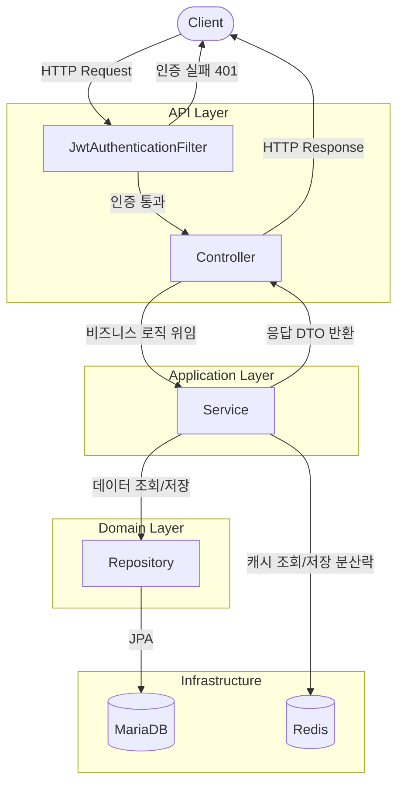
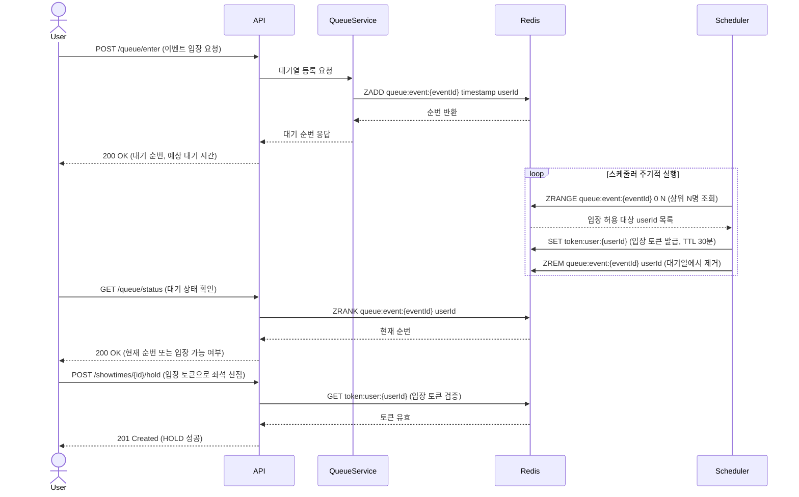
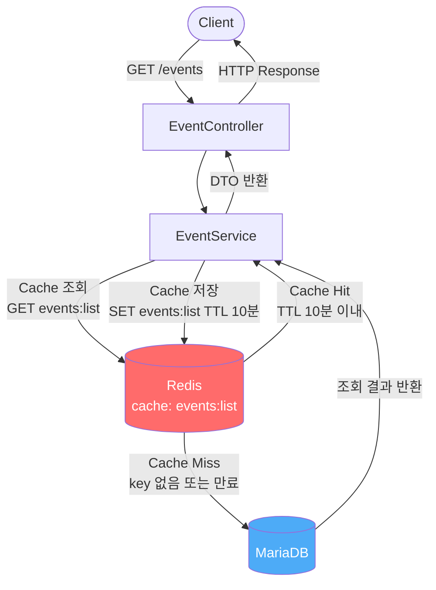

# 아키텍처 다이어그램

---

## 1. 전체 시스템 흐름

클라이언트 요청이 API 레이어를 거쳐 Service → DB/Redis로 처리되는 전체 흐름입니다.

---

## 2. 대기열 흐름

> **초안 문서입니다.** TASK-029 구현 완료 후 실제 구현 기준으로 업데이트 예정입니다.

Redis Sorted Set 기반으로 순번을 발급하고 입장을 허용하는 흐름입니다.

---

## 3. 캐시 흐름

이벤트 목록 조회 시 Redis 캐시를 우선 조회하고 miss 시 DB에서 가져오는 흐름입니다.

---

## Redis Key 요약

| Key | 용도 | TTL |
|---|---|---|
| `refresh:{memberId}` | RefreshToken 저장 | 7일 |
| `blacklist:{accessToken}` | AccessToken 블랙리스트 | 잔여 만료 시간 |
| `events:list` | 이벤트 목록 캐시 | 10분 |
| `queue:event:{eventId}` | 대기열 순번 (Sorted Set) | 이벤트 종료 시 |
| `token:user:{userId}` | 대기열 입장 토큰 | 30분 |
| `lock:seat:{seatId}` | 좌석 분산락 | 락 획득 TTL |