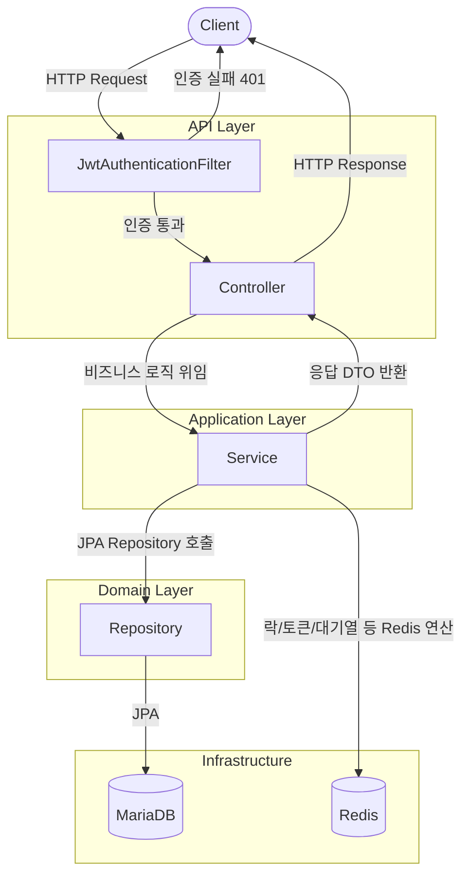
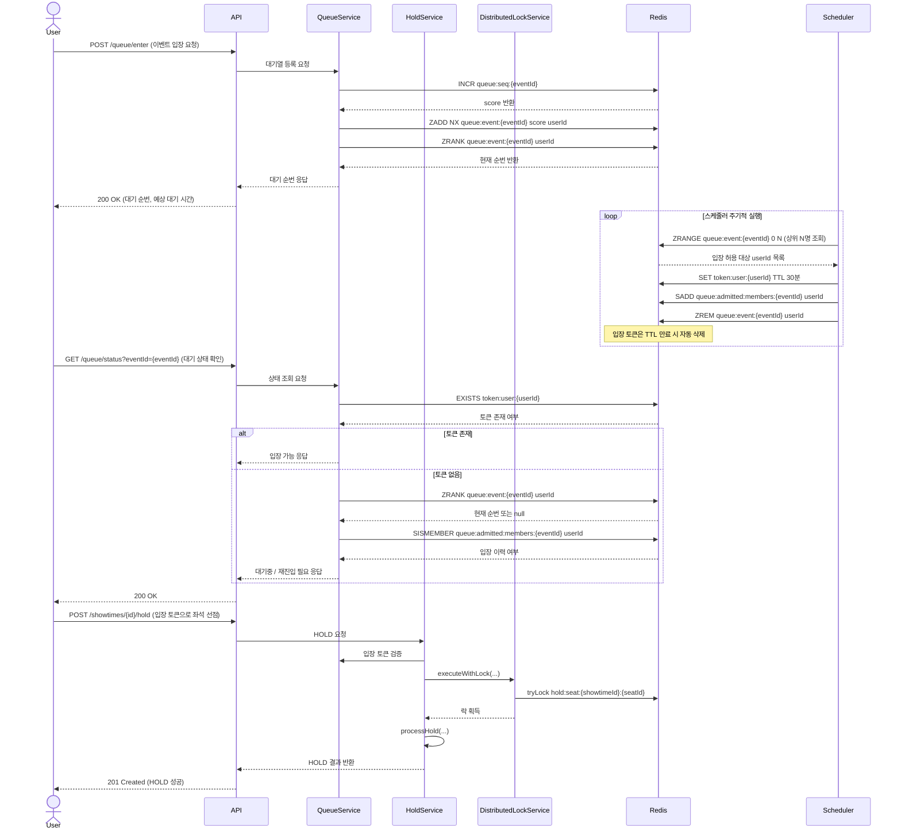
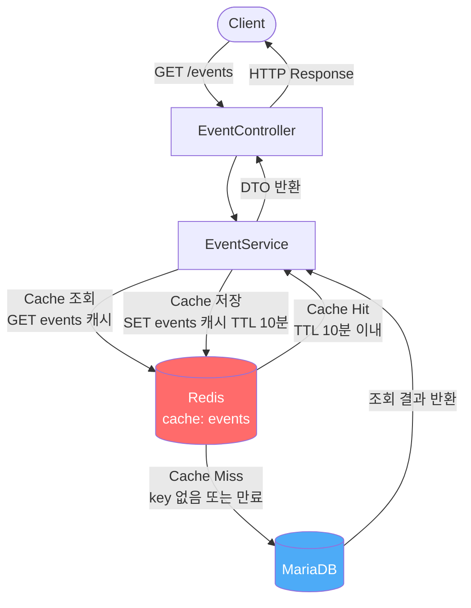

# 아키텍처 다이어그램

---

## 1. 전체 시스템 흐름

클라이언트 요청이 API 레이어를 거쳐 Service → DB/Redis로 처리되는 전체 흐름입니다.

---

## 2. 대기열 흐름

Redis Sorted Set 기반으로 순번을 발급하고 입장을 허용하는 흐름입니다.

---

## 3. 캐시 흐름

이벤트 목록 조회 시 Redis 캐시를 우선 조회하고 miss 시 DB에서 가져오는 흐름입니다.

---

## Redis Key 요약

| Key                                    | 용도                  | TTL / 정리 방식                                      |
|----------------------------------------|---------------------|--------------------------------------------------|
| `refresh:{memberId}`                   | RefreshToken 저장     | 7일                                               |
| `blacklist:{accessToken}`              | AccessToken 블랙리스트   | 잔여 만료 시간                                         |
| `events 캐시 (events::...)`              | 이벤트 목록 캐시           | 10분                                              | 
| `queue:event:{eventId}`                | 대기열 순번 (Sorted Set) | 이벤트 종료 시 key 삭제                                  |
| `token:user:{userId}`                  | 대기열 입장 토큰           | 30분                                              |
| `hold:seat:{showtimeId}:{seatId}`      | 좌석 분산락              | Redisson leaseTime 기반 자동 해제                      |
| `idempotency:payment:{idempotencyKey}` | 결제 멱등성 키            | 24시간                                             |
| `queue:active:events`                  | 활성 대기열 이벤트 목록 (Set) | 종료된 이벤트는 Set에서 제거                                |
| `queue:admitted:members:{eventId}`     | 대기열 입장 허용 이력 (Set)  | 이벤트 종료 시 key 삭제                                  |
| `queue:seq:{eventId}`                  | 대기열 순번 카운터 (INCR)   | 현재 구현상 명시적 TTL 없음 / 종료 정리 정책은 TASK-057-1에서 보완 예정 |

---

## 4. 아키텍처 의사결정 기록 (ADR)

핵심 설계 결정의 배경과 트레이드오프를 ADR(Architecture Decision Record) 형식으로 기록합니다.

| ADR                                      | 제목                                            | 상태      |
|------------------------------------------|-----------------------------------------------|---------|
| [ADR-001](adr/ADR-001-no-kafka.md)       | Kafka 미도입 — 단일 트랜잭션 직접 상태 전환 유지               | Decided |
| [ADR-002](adr/ADR-002-mock-payment.md)   | Mock 결제 — PG 연동 없이 forceFailure 플래그로 성공/실패 재현 | Decided |
| [ADR-003](adr/ADR-003-no-outbox.md)      | Outbox Pattern 미적용 — 단일 트랜잭션으로 상태 일관성 유지      | Decided |
| [ADR-004](adr/ADR-004-no-soft-delete.md) | Soft Delete 미적용 — 상태값으로 비활성 데이터 처리            | Decided |