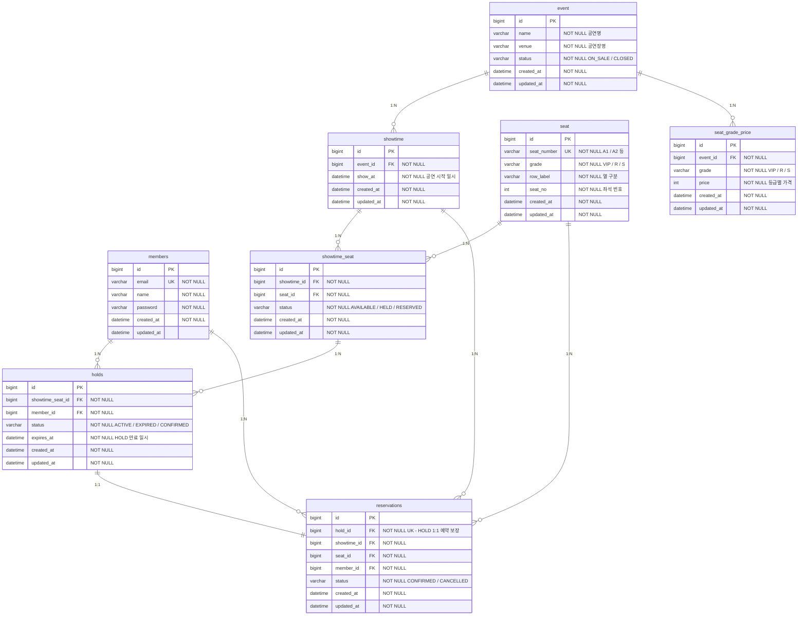

# ERD

## 테이블 관계도

---

## 테이블 설명

| 테이블 | 설명 |
|---|---|
| `members` | 회원 기본 정보 (이메일/비밀번호/이름) |
| `event` | 공연 기본 정보 (공연명/공연장/상태) |
| `showtime` | 공연 회차 정보 (공연 ID/시작 일시) |
| `seat` | 좌석 마스터 정보 (좌석 번호/등급/위치) |
| `seat_grade_price` | 공연별 등급 가격 정보 |
| `showtime_seat` | 회차별 좌석 상태 (AVAILABLE / HELD / RESERVED) |
| `holds` | 좌석 선점 정보 (만료 일시/상태) |
| `reservations` | 예약 확정 정보 (CONFIRMED / CANCELLED) |

---

## 인덱스

| 테이블 | 인덱스명 | 컬럼 | 목적 |
|---|---|---|---|
| `members` | `uk_members_email` | `email` | 이메일 중복 방지 |
| `seat` | `uk_seat_number` | `seat_number` | 좌석 번호 중복 방지 |
| `seat_grade_price` | `uk_event_grade` | `event_id, grade` | 공연별 등급 중복 방지 |
| `showtime_seat` | `uk_showtime_seat` | `showtime_id, seat_id` | 회차-좌석 중복 방지 |
| `showtime_seat` | `idx_showtime_seat_showtime_id_status` | `showtime_id, status` | 회차별 좌석 상태 조회 최적화 |
| `holds` | `idx_holds_showtime_seat_id` | `showtime_seat_id` | 회차 좌석 선점 조회 최적화 |
| `holds` | `idx_holds_status_expires_at` | `status, expires_at` | 만료 HOLD 스케줄러 조회 최적화 |
| `reservations` | `uk_reservations_hold_id` | `hold_id` | HOLD 1:1 예약 보장 |