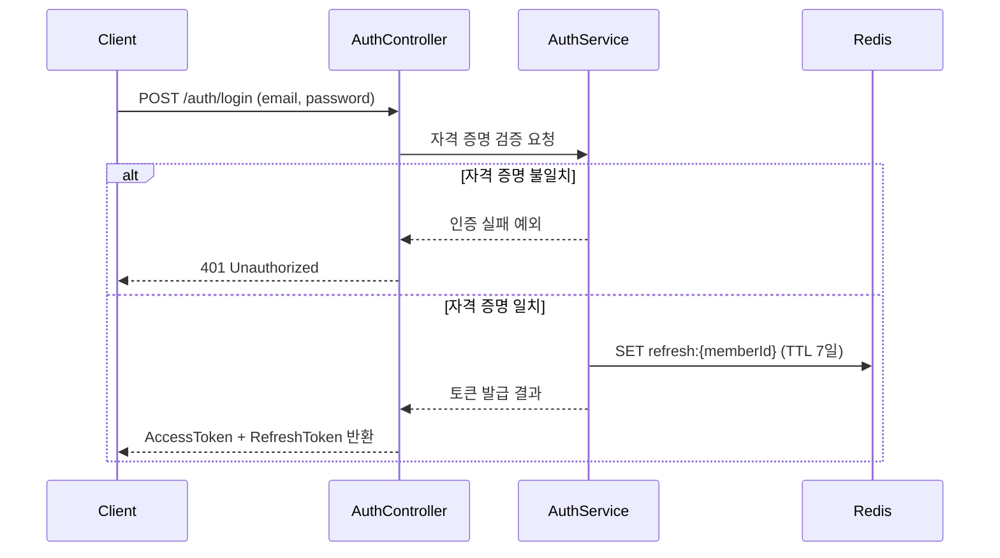
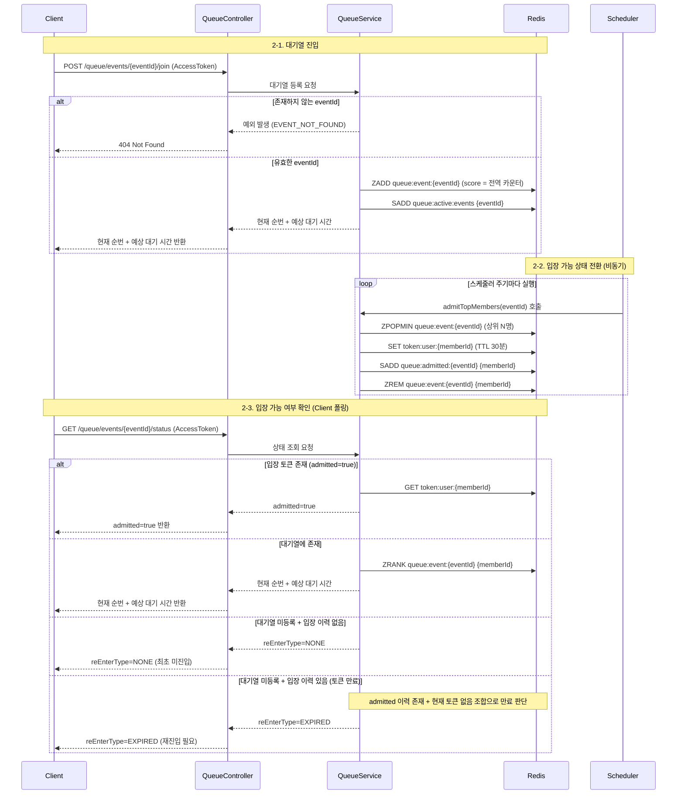
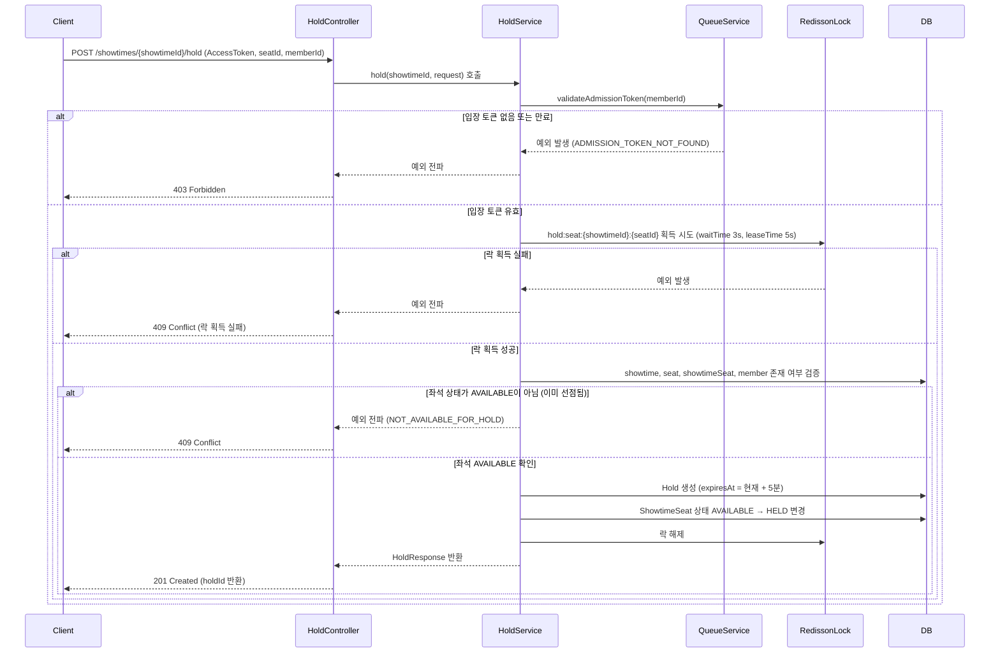
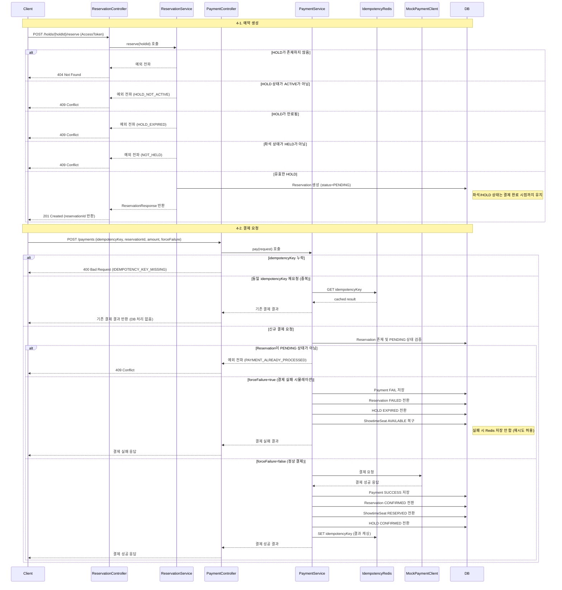
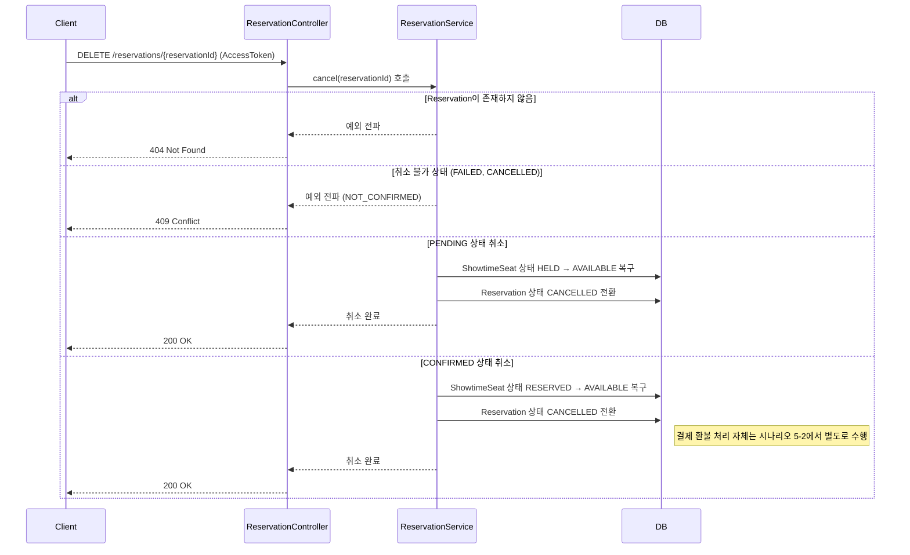
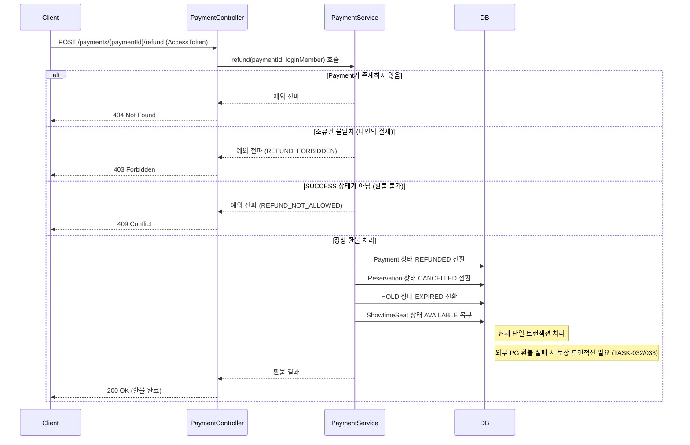

# 전체 예약 흐름 시나리오

이 문서는 티켓팅 서비스의 전체 예약 흐름을 시나리오별로 정리한 설계 기준 문서입니다.

- README의 요약 다이어그램은 전체 흐름을 압축하여 보여줍니다.
- 이 문서는 시나리오별 상세 흐름과 예외 분기를 포함합니다.
- 이후 ADR, 정합성 전략, E2E 테스트 기준 문서의 공통 기준선으로 사용됩니다.

---

## 시나리오 1. 로그인 및 토큰 발급

사용자가 인증에 성공하고 AccessToken / RefreshToken을 발급받는 흐름입니다.

- JWT 기반 인증
- RefreshToken은 Redis에 저장하여 재발급 및 로그아웃 제어 기반 확보

---

## 시나리오 2. 대기열 진입 및 입장 가능 상태 전환

사용자가 이벤트 대기열에 진입하고, Scheduler가 비동기로 입장 가능 상태로 전환하며,
사용자가 별도 조회 API로 입장 가능 여부를 확인하는 흐름입니다.

- Redis Sorted Set으로 대기 순서 관리 (score = 진입 timestamp 기반 전역 카운터)
- Scheduler가 비동기로 상위 N명을 입장 가능 상태로 전환
- Client 응답은 별도 조회 흐름에서 확인 (진입 응답과 입장 가능 응답은 분리)

---

## 시나리오 3. 좌석 선점 (HOLD)

입장 토큰을 가진 사용자가 특정 좌석에 대해 HOLD를 생성하는 흐름과 동시성 제어 방식입니다.

- 입장 토큰 검증은 HoldService 내부에서 분산락 획득 전에 수행
- Redisson 분산락으로 동일 회차의 동일 좌석에 대한 동시 HOLD 요청 직렬화
- 락 내부에서 좌석 상태를 재검증하여 정합성 보장
- 락 키: `hold:seat:{showtimeId}:{seatId}` (같은 회차의 같은 좌석만 직렬화)

---

## 시나리오 4. 예약 생성 및 결제

HOLD된 좌석을 기반으로 예약을 생성하고 결제를 수행하는 흐름입니다.
예약 생성과 결제는 분리된 단계로, 각각 독립 API 호출로 처리됩니다.

- reserve 시점: Reservation PENDING 생성, 좌석/HOLD 상태는 유지
- 결제 성공 시: Reservation CONFIRMED, 좌석 RESERVED, HOLD CONFIRMED
- 결제 실패 시: Reservation FAILED, HOLD EXPIRED, 좌석 AVAILABLE 복구
- idempotencyKey로 네트워크 재시도 시 결제 중복 방지 (Redis 기반)
- 결제 실패 시 forceFailure=true로 재시도 허용 (Redis 저장 안 함)

---

## 시나리오 5-1. 예약 취소 (PENDING / CONFIRMED)

PENDING 또는 CONFIRMED 상태의 예약을 취소하고 좌석을 복구하는 흐름입니다.
환불이 필요한 경우 결제 환불 API는 별도 시나리오 5-2에서 처리합니다.

- 취소 허용 상태: PENDING, CONFIRMED (FAILED, CANCELLED는 불가)
- 취소는 단순 삭제가 아니라 CANCELLED 상태로 전이 (이력 보존)
- 예약 취소와 결제 환불은 분리된 API로 처리한다
- 결제 환불은 시나리오 5-2에서 다룬다

---

## 시나리오 5-2. 결제 환불

CONFIRMED 상태의 결제 건에 대해 환불을 요청하고 Payment / Reservation / HOLD / 좌석 상태를 복구하는 흐름입니다.

- 소유권 검증을 상태 검증보다 먼저 수행하여 타인의 결제 상태 유추 방지
- 상태 전이 순서: Payment REFUNDED → Reservation CANCELLED → HOLD EXPIRED → 좌석 AVAILABLE
- 현재 구현은 단일 트랜잭션 내 상태 전이만 처리하며, 외부 PG 환불 연동은 미구현
- 외부 PG 환불 실패 시 데이터 불일치 위험 존재 → 보상 트랜잭션 도입 검토 필요 (TASK-032/033)

