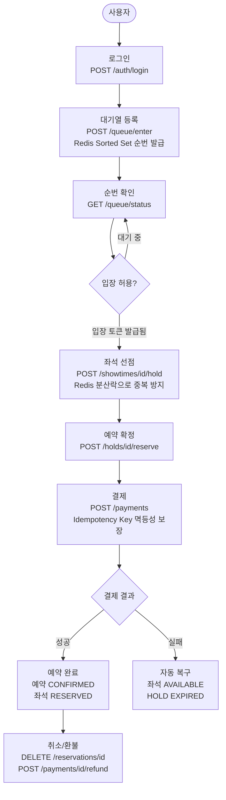
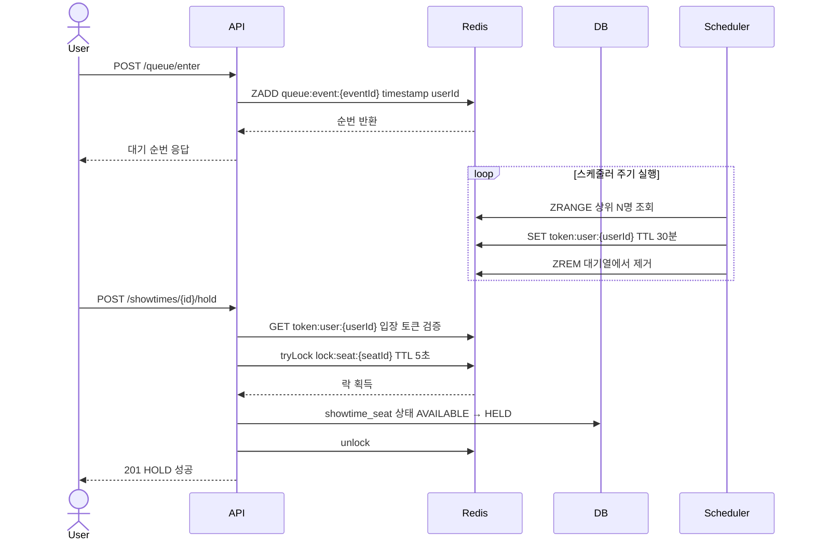

# 서비스 전체 요약

## 이 프로젝트가 해결하는 문제

티켓팅 서비스는 오픈 직후 수만 명이 동시에 동일 좌석을 선점하려 하고
네트워크 재시도로 인한 중복 결제, 트래픽 폭증으로 인한 DB 부하 집중 등
일반 CRUD 서비스와 다른 동시성·신뢰성 문제가 발생한다.

| 문제 | 해결 기술 |
|---|---|
| 동일 좌석 동시 선점 | Redis 분산락 (Redisson) |
| 트래픽 폭증 시 DB 부하 집중 | Redis Sorted Set 대기열 |
| 네트워크 재시도로 인한 중복 결제 | Idempotency Key (Redis) |
| AccessToken 탈취 | RefreshToken Rotation + Redis 블랙리스트 |

---

## 전체 요청 흐름

### 대기열 + 선점 핵심 구간

---

## 핵심 기술 결정 5가지

### 1. Redis 분산락 (Redisson)

**선택 이유:** DB 비관적 락(`SELECT ... FOR UPDATE`)은 락을 점유하는 동안 DB 커넥션을 유지한다.
HikariCP 기본 커넥션 풀은 10개로, 500 TPS 폭증 구간에서 선점 요청(20% = 100 TPS)이 집중되면
커넥션 풀이 고갈되고 락 대기 스레드가 누적된다.
Redis 분산락은 DB 외부에서 락을 관리하므로 DB 부하를 분리할 수 있고
멀티 인스턴스 환경에서도 동일하게 동작한다.

**Redisson을 선택한 이유:** Lettuce 기반 직접 구현은 TTL 갱신, 락 해제 실패 처리,
재시도 로직을 직접 관리해야 해 복잡도가 높다.
Redisson의 `RLock`은 `tryLock(waitTime, leaseTime, TimeUnit)` 인터페이스로
타임아웃과 자동 해제(leaseTime)를 안정적으로 제공한다.

**동시성 테스트 결과:** 100 스레드 동시 선점 요청 → 성공 1건, 중복 선점 0건

> 상세: [W4 devlog](devlog/2026-03-20-w4-wrapup.md)

---

### 2. Redis Sorted Set 대기열

**선택 이유:** 20,000명이 동시에 선점 API를 직접 호출하면 Redis 분산락 경합이
서버가 처리 가능한 수준을 초과한다.
Sorted Set의 score를 진입 timestamp로 사용하면 진입 순서가 자동으로 보장되고
`ZRANK`로 현재 순번을 O(log N)에 조회할 수 있다.
Kafka 등 별도 MQ 인프라 없이 이미 도입된 Redis 하나로 처리할 수 있다.

**SCAN 대신 Set으로 활성 이벤트 관리한 이유:** `SCAN`은 Redis keyspace 전체를 순회해
키가 많을수록 성능이 저하되고 운영 환경에서 부하를 유발한다.
`queue:active:events` Set에 활성 이벤트 ID를 관리하면 O(1)으로 조회 가능하다.

> 상세: [W6 devlog](devlog/2026-04-03-w6-wrapup.md) · [Queue API](api/queue.md)

---

### 3. Idempotency Key (Redis 저장)

**선택 이유:** 네트워크 재시도로 동일 결제 요청이 여러 번 도달할 수 있다.
DB에 저장하면 결제 요청마다 `SELECT` 쿼리가 발생해 부하가 증가한다.
Redis에 저장하면 중복 요청 감지를 DB 접근 없이 처리할 수 있고
TTL(24시간)로 오래된 키가 자동 정리된다.

**결제 실패 시 Redis에 저장하지 않는 이유:** 결제 실패는 재시도를 허용해야 하므로
성공한 경우에만 idempotency key를 저장한다.

> 상세: [Payment API](api/payment.md)

---

### 4. RefreshToken Rotation

**선택 이유:** 단순 재발급 방식은 탈취된 RefreshToken이 만료 전까지 유효하다.
Rotation 방식은 재발급마다 Redis 토큰이 교체되므로 기존 토큰이 즉시 무효화된다.
피해자가 탈취된 토큰으로 재발급을 시도하면 Redis 저장값과 불일치로 탈취를 감지하고
즉시 강제 로그아웃 처리한다.

**삭제 후 예외 throw 순서의 이유:** 예외를 먼저 throw하면 `deleteRefreshToken()`이
실행되지 않아 해커가 보유한 새 토큰이 유효한 상태로 남는다.
삭제를 먼저 처리해야 해커·피해자 모두 강제 로그아웃이 완전히 보장된다.

> 상세: [Auth API](api/auth.md) · [W5 devlog](devlog/2026-03-27-w5-wrapup.md)

---

### 5. 소유권 검증 순서 설계

**선택 이유:** 상태 검증을 먼저 수행하면 타인이 `paymentId`를 추측했을 때
"이미 환불됨(409)" vs "결제 없음(404)" 처럼 결제 상태 정보가 응답 코드 차이로 노출된다.
소유권 검증을 먼저 수행하면 타인에게는 항상 403만 반환해 정보 노출을 방지한다.

> 상세: [W7 devlog](devlog/2026-04-10-w7-wrapup.md)

---

## 트래픽 처리 전략

| 구간       | 목표 TPS  | p95 응답시간   | p99 응답시간   |
|----------|---------|------------|------------|
| 정상 트래픽   | 50 TPS  | 200ms 이하   | 500ms 이하   |
| 티켓 오픈 폭증 | 500 TPS | 1,000ms 이하 | 3,000ms 이하 |

**폭증 구간 처리 흐름:**

1. 20,000명 동시 접속 → 대기열 등록으로 요청 순번화
2. 스케줄러가 서버 처리 가능한 수준(상위 N명)만 입장 허용
3. 입장 토큰 보유자만 선점 API 호출 가능 → Redis 분산락으로 중복 방지
4. DB 부하는 Redis 레이어에서 흡수, 실제 DB 접근은 최종 선점 시에만 발생

> 상세: [트래픽 시나리오 문서](performance/traffic-scenario.md)

---

## 데이터 정합성 보장 전략

| 상황       | 처리 방식                                               |
|----------|-----------------------------------------------------|
| 결제 성공    | 예약 CONFIRMED + 좌석 RESERVED + HOLD CONFIRMED 단일 트랜잭션 |
| 결제 실패    | 예약 FAILED + HOLD EXPIRED + 좌석 AVAILABLE 자동 복구       |
| HOLD 미확정 | 스케줄러(30초 주기)가 만료 HOLD 감지 → 좌석 AVAILABLE 복구          |
| 예약 취소    | 예약 CANCELLED + 좌석 AVAILABLE 상태 전이                   |

결제와 상태 전환을 단일 트랜잭션으로 처리한 이유:
결제는 성공했는데 예약이 CONFIRMED로 변경되지 않으면 데이터 불일치가 발생한다.
한쪽이 실패하면 전체가 롤백되도록 단일 트랜잭션으로 묶어 원자성을 보장한다.

---

## 관련 문서

| 문서         | 경로                                                                      |
|------------|-------------------------------------------------------------------------|
| 전체 API 명세  | [docs/api/README.md](api/README.md)                                     |
| 아키텍처 다이어그램 | [docs/architecture/README.md](architecture/README.md)                   |
| ERD        | [docs/erd/README.md](erd/README.md)                                     |
| 트래픽 시나리오   | [docs/performance/traffic-scenario.md](performance/traffic-scenario.md) |
| Devlog     | [docs/devlog/README.md](devlog/README.md)                               |